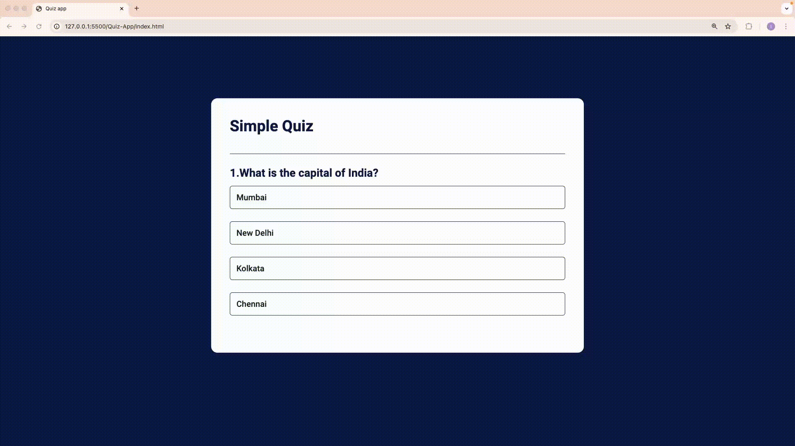

# 🎉 Simple Quiz App 🎉

A fun, interactive, and responsive quiz application built with **HTML**, **CSS**, and **JavaScript**. Test your knowledge and see how well you score! 🧠✨

---

## 🚀 Live Preview

[Click here to try the app! 🌐](https://your-live-link-here.com)

---

## 🎥 Preview

---

## 📋 Features

- 🔹 **Dynamic Questions**: Multiple questions with varied topics.  
- 🔹 **Interactive Feedback**: Highlights correct and incorrect answers.  
- 🔹 **Score Display**: View your score at the end of the quiz.  
- 🔹 **Responsive Design**: Works seamlessly on all device sizes.

---

## 📂 Project Structure

| File         | Description                       |
|--------------|-----------------------------------|
| `index.html` | Contains the structure of the app |
| `style.css`  | Handles the styling of the app    |
| `script.js`  | Contains the app's logic          |

---

## 🌟 Technologies Used

- **HTML**: For structuring the app  
- **CSS**: For styling and responsiveness  
- **JavaScript**: For dynamic and interactive functionality  

---

## 📝 Author

👩‍💻 **Designed and Developed by [Iswarya Sundarrajan](https://www.linkedin.com/in/iswarya26/)**  
📫 Connect with me for more amazing projects!

---
